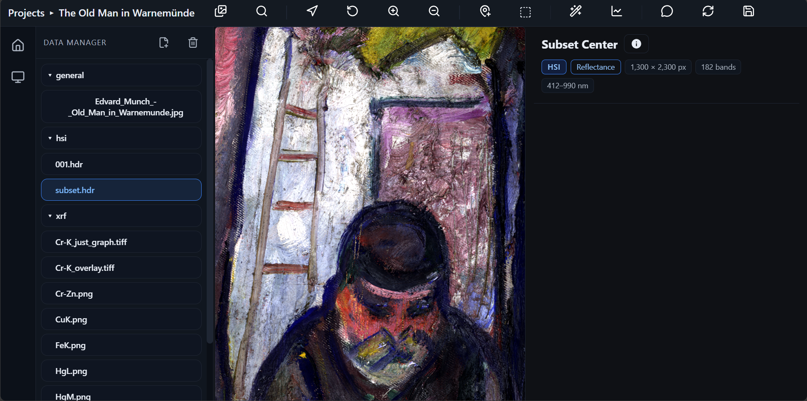
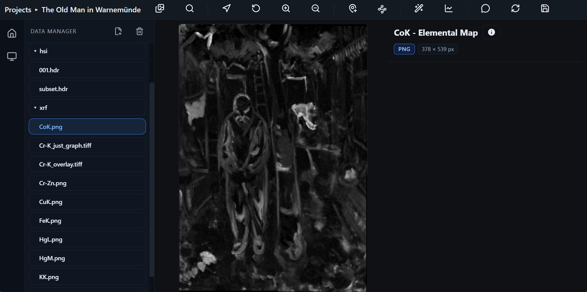
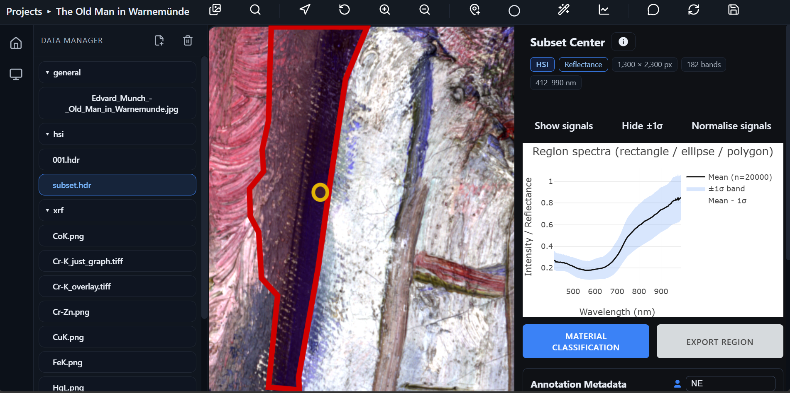
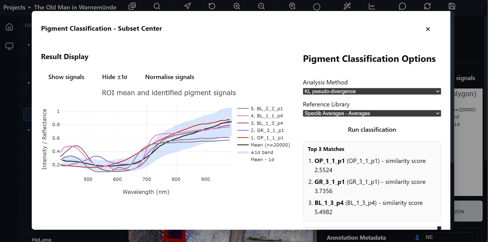
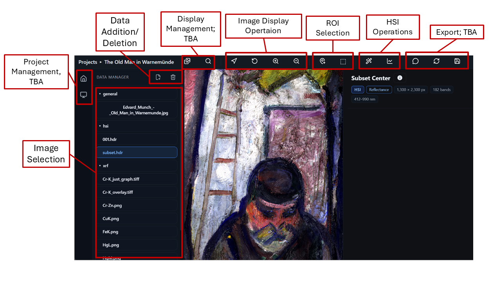

# SpectraPaint

A web application for viewing and analysing hyperspectral image (HSI) data of
paintings together with complementary modalities such as macro X-ray
fluorescence (MA-XRF) and RGB photography. SpectraPaint supports image display
and annotation, spectral plotting, region-of-interest selection, and
pigment/material classification for cultural-heritage imaging.

## Quick start

### Prerequisites

- Node.js (includes npm)
- Python 
- Visual Studio Code; please use the integrated terminal for the following steps

### Frontend

```bash
cd frontend
npm install
npm run build     # production build, used by the packaged app
# or: npm run dev — development server with reload at http://localhost:5173
```

### Backend

The backend is a FastAPI service. `launcher.py` starts it and opens the
application in a native desktop window.

Create a virtual environment and install the runtime requirements into it:

```bash
cd ../backend
python -m venv .venv
```

**Windows**

```bat
.venv\Scripts\pip install -r requirements-runtime.txt
.venv\Scripts\python launcher.py
```

**macOS / Linux**

```bash
.venv/bin/pip install -r requirements-runtime.txt
.venv/bin/python launcher.py
```

## Features and use cases


Display and annotation of a visualisation. In this case, it is an RGB image, annotated to mark
previous investigations of a painting.





Display of HSI and MA-XRF images.





Extraction of a region of interest from an HSI cube and display of its spectral
signals for pigment classification.

## Interface overview



The interface groups the available tools into project management, data
addition and deletion, image selection, display management, image display
operations, ROI selection, HSI operations, and export.

## Repository layout

```text
backend/    FastAPI service and analysis code (Python); launcher.py opens the desktop window
frontend/   React + Vite user interface (TypeScript)
```

## Tech stack

- **Backend:** FastAPI, SQLAlchemy with SQLite (created automatically on first
  run), `spectral` for ENVI cubes
- **Frontend:** React + Vite
- **Packaging:** PyInstaller, pywebview, Inno Setup

The SQLite database is created next to the application at the top level of the
repository in development. 

## Citation

To be announced.
